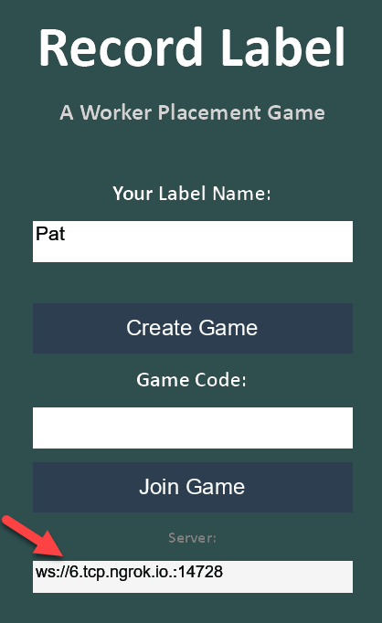

# Tester Setup Guide (Windows)

## 1. Install Python

1. Download Python 3.12 or newer from https://www.python.org/downloads/
2. Run the installer
3. **Check "Add Python to PATH"** on the first screen — this is required
4. Click "Install Now"

To verify, open a Command Prompt and run:

```
python --version
```

You should see `Python 3.12.x` or higher.

## 2. Install Git

1. Download Git from https://git-scm.com/download/win
2. Run the installer — the default options are fine
3. Restart your Command Prompt after installing

To verify:

```
git --version
```

## 3. Clone the Repository

Open a Command Prompt and navigate to where you want the game folder (e.g. your Desktop), then run:

```
git clone https://github.com/pvcraven/Worker-Placement-Game.git
cd Worker-Placement-Game
```

## 4. Run the Game

Inside the `Worker-Placement-Game` folder, double-click **play.bat** or run it from the command line:

```
play.bat
```

On first run this will install all dependencies automatically, start the server, and launch the game client.

## 5. Create a Desktop Shortcut

1. Open the `Worker-Placement-Game` folder in File Explorer
2. Right-click on **play.bat**
3. Select **Show more options** then **Create shortcut**
4. Move the shortcut to your Desktop
5. Optionally right-click the shortcut, select **Rename**, and call it "Worker Placement Game"

Double-click the shortcut anytime to launch the game.

## Updating

Each time you run `play.bat` it automatically pulls the latest version from GitHub before launching. No manual updates needed.

## Multiplayer

One player hosts by running `play.bat` as usual. Other players connect by changing the server address in the game's main menu:



Click the server address field and replace it with the host's address (see below).

### LAN

Other players on the same network enter `ws://<host-ip>:8765`, replacing `<host-ip>` with the host's local IP address (e.g., `ws://192.168.1.42:8765`).

### Internet (via ngrok)

To play with someone outside your local network:

1. Install [ngrok](https://ngrok.com/download) and sign up for a free account
2. Run `play.bat` to start the game server
3. In a separate Command Prompt, run: `ngrok tcp 8765`
4. ngrok will display a forwarding address like `tcp://0.tcp.ngrok.io:12345`
5. Share that address with your friend
6. Your friend enters `ws://0.tcp.ngrok.io:12345` in the server address field

## Troubleshooting

- **"Python not found"** — Reinstall Python with "Add to PATH" checked, then restart your terminal.
- **Game won't update** — If you've accidentally edited files, run `git checkout .` then `play.bat` again.
- **Port already in use** — The launcher tries to clean up old servers automatically. If it fails, restart your computer or manually kill the process on port 8765.
